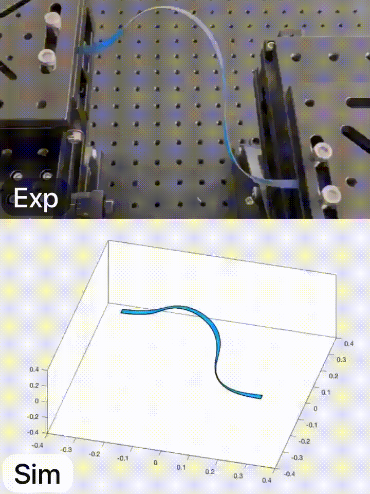

# Snap-through buckling of an elastic ribbon under rotational input

# Overview

Snap-through buckling of an elastic ribbon under rotational input

 

To run this code, you should have a Linux Ubuntu system

# Make

g++ -I /usr/local/include/eigen-3.3.7/ main.cpp world.cpp elasticRod.cpp elasticStretchingForce.cpp elasticRibbonForce.cpp externalGravityForce.cpp inertialForce.cpp dampingForce.cpp timeStepper.cpp setInput.cpp -llapack -lGL -lglut -lGLU -Ofast -o simDER

# Run 

./simDER option.txt
